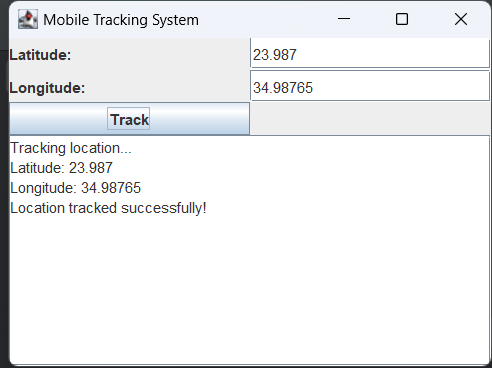

# Mobile Tracking System

This is a simple mobile tracking system built using Java and Swing. The application allows users to enter latitude and longitude coordinates and simulate the tracking of a location.

## Features

- User-friendly GUI with input fields for latitude and longitude.
- Simulates location tracking when the "Track" button is clicked.
- Displays the entered latitude and longitude along with a simulated tracking message.
- Provides basic validation to ensure both latitude and longitude are entered before tracking.

## Requirements

- Java 8 or higher.
- Swing library (bundled with Java, no additional installation required).

## Installation

1. Clone the repository to your local machine:

   ```bash
   git clone https://github.com/your-username/mobile-tracking-system.git
   ```

2. Navigate to the project directory:

   ```bash
   cd mobile-tracking-system
   ```

3. Compile and run the program:

   ```bash
   javac MobileTrackingSystem.java
   java MobileTrackingSystem
   ```

## Usage

- Launch the application, and the user interface will prompt you to input latitude and longitude values.
- After entering the coordinates, click on the "Track" button.
- The application will display the entered coordinates and simulate a location tracking process.

### Example Output:

```
Tracking location...
Latitude: 40.7128
Longitude: -74.0060
Location tracked successfully!
```

## Screenshot

Here's a screenshot of the application interface:



## Acknowledgements

- Java Swing for the graphical user interface.
- Java 8+ for building and running the application.
